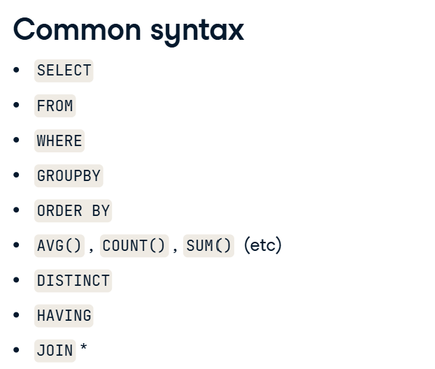
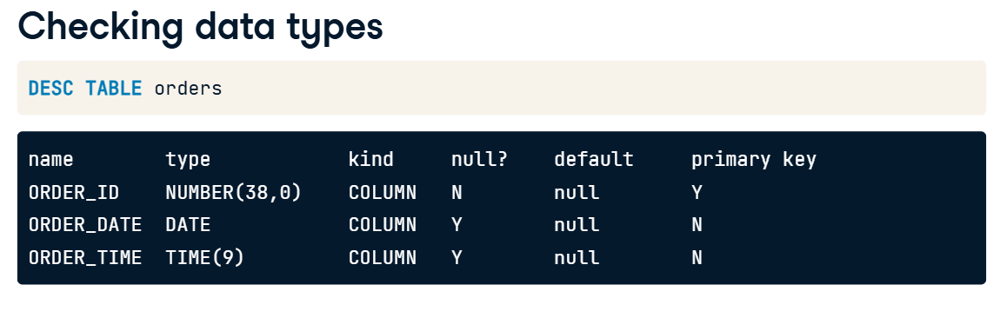
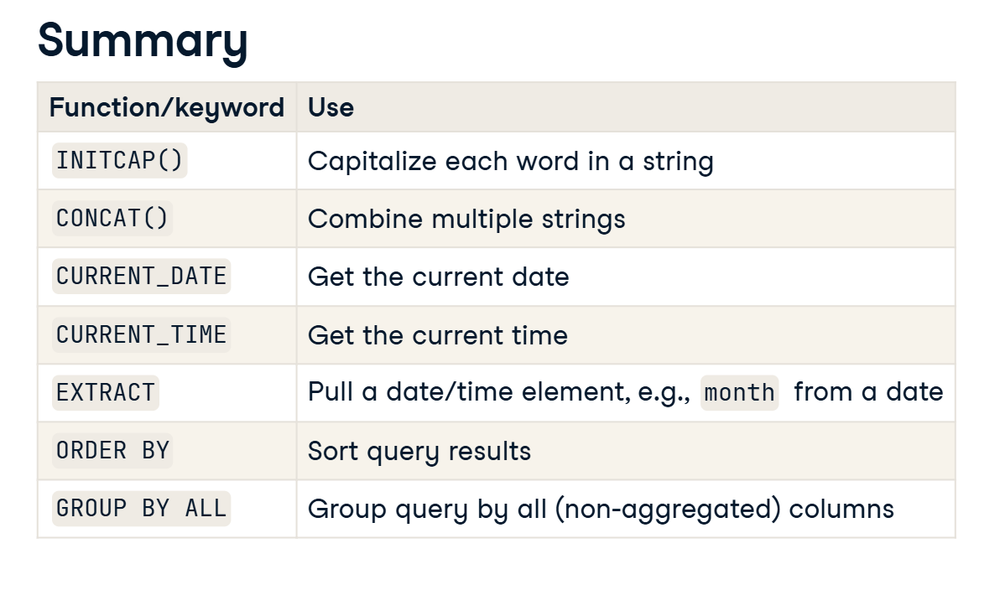
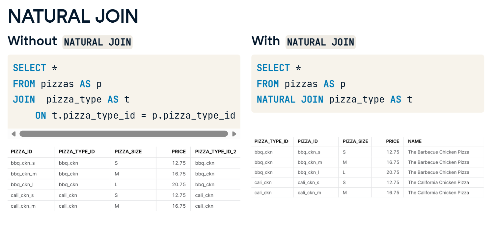
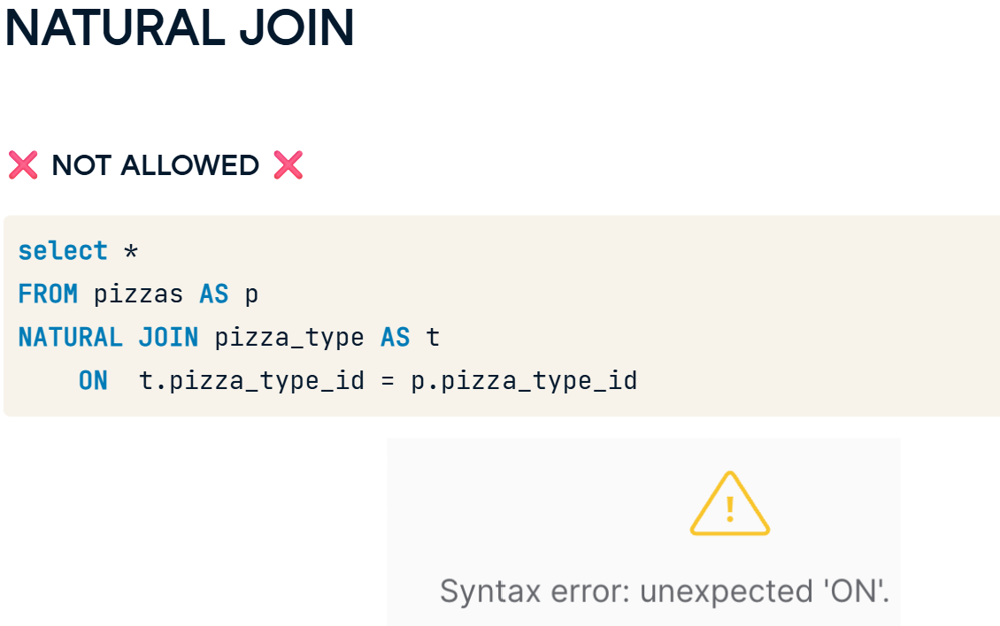
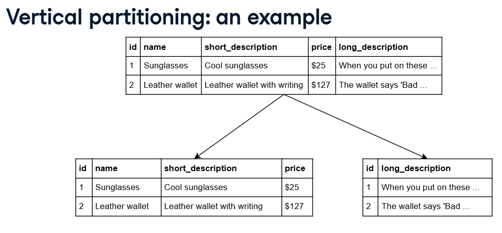

# _Ch1: Snowflake SQL and Key Concepts_

## _Snowflake SQL_

**Connecting to Snowflake**
- There are different ways to connect to snowflake. One of the most user-friendly options is the Web interface called *Snowsight*.
- For those looking to execute SQL queries, Snowflake provides *Worksheets*, an interface for creating and running SQL queries.

- Worksheets can be created which contain the Query, results and execution details such as query duration etc.
- Workbooks can also be created. These can be used to run `SLQ` and `Python` code. A powerful combination for tasks such as creating and maintaining data pipelines.

Beyond its web interface, Snowflake can be used via *Drivers*, which allow communication between its databases and external applications and tools.

Two common drivers include;

1. ODBC (Open Database Connectivity)
2. JDBC (Java Database Connectivity)

Additionally, there are specialized connectors like Python, Spark and more.

The Snowflake CLI (Command Line Interface) is another way to directly connect to snowflake account using the command line.
For the CLI, Snowflake offers versions for Linux, windows, and Mac.

Regardless of how we connect to snowflake, we'd mostly use the Snowflake SQL. 

Snowflake SQL is another flavour of SQL similar to Postgresql, T-SQL, MySQL.

These have differences and similarities in terms of data types, functions, and general syntax.

THe majority of Snowflake SQL and PostgreSQL are the Same like

_**Common Syntax**_
]

**Exercise**: Querying using Snowflake SQL
You are consulting as a Data Engineer at Pissa, an expanding pizza delivery company. Their database has four tables: pizzas, pizza_types, orders, and order_details. You can view each table from the SQL console:

SQL console

As part of their transition from PostgreSQL to Snowflake, you're now examining the different columns in the pizzas table. Are you ready to refresh your SQL skills?

*Instructions*
Select pizza_type_id, pizza_size, and price from the pizzas table.

```sql
-- Select pizza_type_id, pizza_size, and price from pizzas table
SELECT pizza_type_id,
	pizza_size,
    price
FROM pizzas;
```

*Exercise*
Filtering in Snowflake SQL
As part of Pissa's migration from PostgreSQL to Snowflake, ensuring data integrity and correctness of the data after migration is crucial.

You're specifically working with the pizza_type table, which contains the following columns: pizza_type_id, name, category, and ingredients.

Let's apply your SQL skills to Snowflake!

*Instructions 1/2*
Count the total number of rows in the pizza_type table.


```sql
-- Count all pizza entries
SELECT COUNT(*) AS count_all_pizzas
FROM pizza_type;
```
*Instructions 2/2*
Filter the query to count only the pizzas categorized as 'Classic'.
```sql
-- Count all pizza entries
SELECT COUNT(*) AS count_all_pizzas
FROM pizza_type
-- Apply filter on category for Classic pizza types
WHERE category = 'Classic';
```


*Snowflake Data Type*

Many data types are the same between snowflake SQL and POSTGRESQL.
- String / Text can be stored in VARCHAR, CHAR or TEXT.
- Numeric are stored as INTERGERs
- Boolean as TRUE or FALSE
- Date / Time - Date, Time and Timestamp.

*Unique Snowflake Data type*;
1. NUMBER: This is similar to Postgres' NUMERIC data type.
e.g. NUMBER (p, s). We could define presision (p) - The number of units and Scale (s) - the number of decimals.
- Both have a maximum of 38. Max `p` and `s` values: 38
	Exceeding these will roundup resulting in a potential loss of accuracy.

2. TIMESTAMP_LTZ: This combines the DATE and TIME with local time zone in the following format: `YYYY-MM-DD HH:MI:SS

Sometime we may need to convert data between types such as strings to Integer.
Snowflake provides various ways to convert data.

i) The `CAST()` function.

- CAST Syntax: `CAST(<source_data/column> AS <target_data_type>)`
e.g. To convert a VARCHAR 80 to int, we use `CAST('80' AS INT)`

ii) ::Syntax
- `<source_data/column>::<target_data_type>`. Going by the example above, such conversion will be `'80'::INT`

e.g. 
```sql
SELECT CAST (order_timestamp AS DATE) 
	AS order_date
FROM Orders;
```

Alternatively, SNowflake provides a range of conversion functuons like `TO_VARCHAR`, `TO_DATE`.
- `TO_VARCHAR` converts expressions like a number or timestamp to string format. The result is a VARCHAR.
e.g. `SELECT TO_VARCHAR(86)`

Result: 86.

*Checking Data Types*: We can use the `DESC TABLE` followed by the table name to get information on all the columns in the table. e.g. `DESC TABLE orders`.



**Exercise: Checking data types**
As a Data Engineer, it is important to understand how and where your data is stored so that you can optimize for cost, speed, and accuracy.
You are still familiarizing with the data at Pissa, so you decide to get storage information about the columns in one of their tables.

*Instructions*
Get information about the orders table.

```sql
-- Get information about the orders table
DESC TABLE orders
```

**Exercise: Data type conversion**
When working with databases, there are times when you need to change the data type of a column to better suit your operations or analyses.

Continuing your Data Engineer role at Pissa, you will practice converting data between types.

Instructions 1/2
1. Select and convert the order_id column from the orders table to VARCHAR using CAST(), aliasing it to order_id_string.

```sql
-- Convert order_id to VARCHAR aliasing to order_id_string
SELECT CAST(order_id AS VARCHAR) AS order_id_string
FROM orders
```

2. Select the price column from the pizzas table, converting it (using the double colon operators) to NUMBER data type and aliasing as price_dollars.
```sql
SELECT price, 
-- Convert price to NUMBER data type
price::NUMBER AS price_dollars
FROM pizzas
```


*Functions, Sorting and Grouping*

 1. String Functions: these are crucial when working with text data.

 `INITCAP (<exp>)`:
 - This capitalizes each word in a string.
```sql
SELECT INITCAP (category) AS capitalized_category
FROM pizza_type;
```
 - `CONCAT`: snowflake also supports many functions in PostGres. One of it is CONCAT used in joining strings together.
```sql
SELECT CONCAT(Category, ' - pizza') AS pizza_category
FROM pizza_type;
```

 - Date and Time: snowlake uses `CURRENT_DATE` shows us the exact date and `CURRENT_TIME`shows the exact time.
 - Another useful functon is `EXTRACT` qhich allows pulling the year, month or day from a date value.
```sql
EXTRACT (<date_or_time_part> FROM <date_or_time_expr>)
```
 - <date_or_time_part> - year, month, day, weekday, etc.

 - `SORTING and GROUPING`: Just as in PostGres, we use `ORDER BY` to sort and `GROUP BY` to group data.
 - What sets SNowlake apart is its unique `GROUP BY ALL` feature. This allows GROUPING by all variables in the SELECT list without mentioning each one by one.




**Exercise**
String functions
Having recently mastered some Snowflake SQL string functions, you're ready to put them into practice using Pissa's database!

Instructions 1/2

1. Capitalize each word in the pizza_type_id column.

```sql
-- Capitalize each word in pizza_type_id
SELECT INITCAP(pizza_type_id) AS capitalized_pizza_id 
FROM pizza_type;
```

2. Use an appropriate function to combine the name and category columns.

```sql
-- Combine the name and category columns
SELECT CONCAT(name, ' - ', category) AS name_and_category
FROM pizza_type;
```


**Exercise**
DATE & TIME
As a Data Engineer at Pissa, you are now focusing on timestamp-related columns in their raw pizzas data.

Use your knowledge of date and time functions to accomplish the tasks.

Instructions 1/2

1. Select the current date and current time using valid date and time functions.

```
-- Select the current date, current time
SELECT CURRENT_DATE, CURRENT_TIME
FROM pizzas;
```

2. Count the number of records.
Extract the day of the week from order_date, aliasing as order_day.

```sql
-- Count the number of orders per day
SELECT COUNT(*) AS orders_per_day, 
-- Extract the day of the week and alias to order_day
	EXTRACT(day FROM order_date) AS order_day
FROM orders
GROUP BY order_day
ORDER BY orders_per_day DESC
```


**Exercise**
Functions & Grouping
You're examining pizza order details at Pissa. The team is interested in investigating revenue generated by different pizza sizes per month.

Complete the query using your knowledge of aggregate functions, sorting, and grouping to support the team with their analysis.

*Instructions*

Get the month from the order_date column.
Use appropriate Snowflake SQL keywords to group the query results.
Arrange your results by revenue in descending sequence

```sql
-- Get the month from order_date
SELECT EXTRACT(month FROM order_date) AS order_month, 
    p.pizza_size, 
    -- Calculate revenue
    SUM(p.price * od.quantity) AS revenue
FROM orders o
INNER JOIN order_details od USING(order_id)
INNER JOIN pizzas p USING(pizza_id)
-- Appropriately group the query
GROUP BY ALL
-- Sort by revenue in descending order
ORDER BY revenue DESC;
```


# _Ch2: Advanced Snowflake SQL Concepts_

## JOINing IN SNOWFLAKE:

Here we'd focus on Natural and Lateral joins.

1. **Natural Joins**: unlike standard Joins, `NATURAL JOIN`s eliminate duplicate columns by automatically matching columns with the same name.
- It is therefore convenient for quickly matching colu,mns with the ame name across two tables, and elimanates the need for the ON function as well.
- It joins two tables without explicitly stating the matching conditions.



- Trying to specify a `JOIN`ing condition will result in an error.



- The `WHERE` clause can be used to filter the results.

2. **Lateral Joins**: This brings more flexibility. It allows a subquery within a `FROM` clause to access columns from a preceding table or view. So when we use LATERAL, 
   the right hand subquery can reference columns from the left hand table, making the queries more dynamic. The `JOIN` keyword is not necessary and the query needs to be aliased 
   at the end else there is an error.

```sql
SELECT
    p.pizza_id,
    lat.name,
    lat.category
FROM pizzas AS p,
LATERAL
    ( SELECT *
      FROM pizza_type AS t
      WHERE p.pizza_type_id = t.pizza_type_id
    ) AS lat;
```
So why not just use a join? The lateral makes it more flexible in cases where we want the right hand sub-query to perform more complex operations dependent on the left hand table.


**Exercise**
NATURAL JOIN
Pissa, the ever-expanding pizza delivery enterprise, has a new challenge for you. They're interested in discovering which type of pizza generates the most revenue.

Here is the pizza schema for reference:



Identify the single top-selling pizza category using your knowledge of NATURAL JOIN.

Instructions
100 XP
Get the category from the appropriate table.
NATURAL JOIN the pizza_type table.
Group the records by category from the pt (pizza_type) table.
Order the details by total_revenue in descending order and limit to a single record, so that only the top revenue-generating pizza is returned.

```sql
SELECT
	-- Get the pizza category
    pt.category,
    SUM(p.price * od.quantity) AS total_revenue
FROM order_details AS od
NATURAL JOIN pizzas AS p
-- NATURAL JOIN the pizza_type table
NATURAL JOIN pizza_type AS pt
-- GROUP the records by category
GROUP BY pt.category
-- ORDER by total_revenue and limit the records
ORDER BY total_revenue DESC
LIMIT 1;
```

**Exercise**
The world of JOINS
Previously, you generated insights for Pissa around their sales and revenue by month. Now, you'll look into their most popular pizzas.

Apply your knowledge of joins to get the desired result.

**Instructions 1/2**

Calculate the total revenue using the price column from the pizzas table and the quantity column of the order_details table, respectively.
Use an appropriate JOIN to include all records from the pizzas table.

```sql
SELECT COUNT(o.order_id) AS total_orders,
        AVG(p.price) AS average_price,
        -- Calculate total revenue
        sum(p.price*od.quantity) AS total_revenue	
FROM orders AS o
LEFT JOIN order_details AS od
ON o.order_id = od.order_id
-- Use an appropriate JOIN with the pizzas table
RIGHT JOIN pizzas AS p
ON od.pizza_id = p.pizza_id;
```

**Instructions 2/2**

Select pizza name from pizza_type.
Perform a NATURAL JOIN with the pizza_type table.

```sql
SELECT COUNT(o.order_id) AS total_orders,
        AVG(p.price) AS average_price,
        -- Calculate total revenue
        SUM(p.price * od.quantity) AS total_revenue,
        -- Get the name from the pizza_type table
		pt.name AS pizza_name
FROM orders AS o
LEFT JOIN order_details AS od
ON o.order_id = od.order_id
-- Use an appropriate JOIN with the pizzas table
RIGHT JOIN pizzas p
ON od.pizza_id = p.pizza_id
-- NATURAL JOIN the pizza_type table
NATURAL JOIN pizza_type AS pt
GROUP BY pt.name, pt.category
ORDER BY total_revenue desc, total_orders desc
```
To be completed before the year ends.


